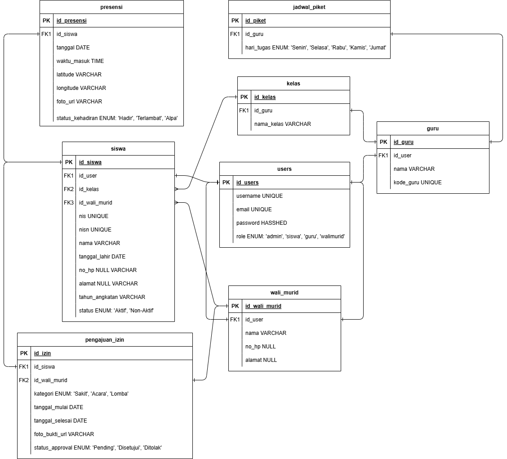

<div align="center">
  

  <h1>SMART Absen SMA UII</h1>
  <p><strong>Integrated Digital Attendance System based on Web with Geolocation & Camera Biometrics</strong></p>

  <p align="center">
    <a href="https://SMA-UII-Yogyakarta.github.io/aksesekolah"></a>
    <a href="docs/01-arsitektur-monorepo.md"></a>
    <a href="docs/03-requirement-analisis.md"></a>
    <a href="docs/04-erd-database.md"></a>
    <a href="docs/08-budget-timeline-roadmap.md"></a>
    <a href="LICENSE"></a>
  </p>
</div>

---

## About the Project

**SMART Absen SMA UII** is a responsive web-based student attendance information system that automates attendance recording using the following technologies:

- **Geolocation API** — locks the student's coordinate point during attendance
- **WebRTC / Camera** — takes a live selfie (not from gallery)
- **Client-Side Compression** — images are compressed to ≤20 KB before sending
- **Single Sign-On** — one account for the entire SMA UII application ecosystem

Designed to handle **750+ concurrent students** during peak hours (06:30–07:00 WIB) at **SMA UII Yogyakarta**.

### Key Features

| Module | User | Function |
|---|---|---|
| Live Attendance | Student | Selfie + GPS → real-time attendance recording |
| Dashboard | All | Statistics & charts based on role |
| Data Management | Admin | CRUD + Excel bulk import/export |
| Leave Submission | Guardian | Submit sick/event/competition leave + upload evidence |
| Leave Verification | Homeroom Teacher | Approve/reject student leave |
| Monitoring | Duty Teacher | Real-time attendance monitoring per class |
| Reports | Admin/Teacher | PDF & Excel export daily/monthly/semester |
| Settings | Admin | Configure attendance hours & academic calendar |

---

## Monorepo Architecture

This repository is a **monorepo entrypoint** that uses **git submodules** to separate application concerns:

```
smauii-aksesekolah/
├── apps/
│   ├── backend/    →  core.git     (Laravel 13)
│   ├── frontend/   →  webapp.git   (React/Vue)  [future]
│   └── mobile/     →  flutter.git  (Android/iOS) [future]
├── packages/       →  SMA UII internal libraries [future]
├── brief/          →  initial planning documents
└── docs/           →  complete technical documentation
```

| Repository | URL | Description |
|---|---|---|
| `aksesekolah.git` | [`SMA-UII-Yogyakarta/aksesekolah`](https://github.com/SMA-UII-Yogyakarta/aksesekolah) | This monorepo |
| `core.git` | [`SMA-UII-Yogyakarta/core`](https://github.com/SMA-UII-Yogyakarta/core) | Laravel Backend |

---

## Quick Start Guide

### Prerequisites

- [Laragon](https://laragon.org) 6.0+ (full stack web environment)
- PHP 8.4+, PostgreSQL 16+, Composer, Bun
- Git + SSH key registered on GitHub

### Backend Setup

```bash
# Clone core to Laragon
cd C:\laragon\www
git clone git@github.com:SMA-UII-Yogyakarta/core.git smauii-core

# Install dependencies
composer install

# Environment configuration
cp .env.example .env
php artisan key:generate

# Database setup & migration
php artisan migrate --seed
```

Open `http://smauii-core.test` — application ready to use.

### Monorepo Setup (for Maintainer)

```bash
git clone --recurse-submodules git@github.com:SMA-UII-Yogyakarta/aksesekolah.git
```

---

## Online Documentation

All technical documentation is available in two formats:

| Format | URL | Advantage |
|---|---|---|
| **🌐 GitHub Pages** | [SMA-UII-Yogyakarta.github.io/aksesekolah](https://SMA-UII-Yogyakarta.github.io/aksesekolah) | Responsive web view, easy navigation, suitable for *onboarding* & *handover* |
| **📁 Markdown (repo)** | [`docs/`](docs/README.md) | Direct access from GitHub, can be edited & reviewed via PR |

### Document List

| Document | Content |
|---|---|
| [Monorepo Architecture](docs/01-arsitektur-monorepo.md) | Submodules, directory layout, diagrams |
| [Development Environment](docs/02-lingkungan-development.md) | Laragon, PHP 8.4, PostgreSQL 16, troubleshooting |
| [Requirement Analysis](docs/03-requirement-analisis.md) | Functional (14 features) + Non-functional (12 items) |
| [ERD & Database](docs/04-erd-database.md) | 10 tables, indexing strategy, SQL DDL |
| [Module & Flow](docs/05-modul-alur-flow.md) | Complete scenarios for each role |
| [Security & SSO](docs/06-keamanan-sso.md) | Sanctum, RBAC, Triple-Layer Validation |
| [Git Workflow](docs/07-git-workflow-submodule.md) | Branching, submodule management, CI |
| [Budget & Timeline](docs/08-budget-timeline-roadmap.md) | Rp 8.5 million, 8 weeks, 3-phase roadmap |
| [Deployment](docs/09-deployment-infrastruktur.md) | VPS, Nginx, tuning, object storage |

---

## Tech Stack

| Layer | Technology |
|---|---|
| **Backend** | PHP 8.4 / Laravel 13 |
| **Database** | PostgreSQL 16 (NeonDB) |
| **Cache & Queue** | Redis |
| **Object Storage** | S3-compatible (Wasabi / MinIO / Backblaze B2) |
| **Web Server** | Apache (dev) / Nginx (production) |
| **Frontend** | InertiaJS 3 + React 19 + TypeScript + Tailwind CSS 4 + Vite |
| **Auth** | Laravel Sanctum (SSO / Identity Provider) |

---

## License

This project is developed by **PT Koneksi Jaringan Indonesia** (*Software House — Agency Koneksi Digital*) as the official information technology development partner of **SMA UII Yogyakarta** and is licensed under the MIT license.

> **Copyright** — Source code © 2025–2026 PT Koneksi Jaringan Indonesia. All rights reserved. Source code is provided for the operational purposes of SMA UII Yogyakarta. **PROHIBITED** from selling, redistributing, or using outside the SMA UII Yogyakarta environment without written permission from PT Koneksi Jaringan Indonesia and SMA UII Yogyakarta. Credit remains with PT Koneksi Jaringan Indonesia to maintain authenticity and prevent illegal third-party selling outside the agreement.

---

<div align="center">
  <p>
    <strong>PT Koneksi Jaringan Indonesia</strong><br />
    <em>Software House — Agency Koneksi Digital</em>
  </p>
  <p>
    <strong>SMA UII Yogyakarta</strong><br />
    Jl. Taman Siswa No.158, Wirogunan, Mergangsan, Kota Yogyakarta, DIY 55151<br />
    Telp: (0274) 489693
  </p>
  <p>
    <a href="https://github.com/SMA-UII-Yogyakarta">🏫 GitHub Organization</a> ·
    <a href="https://www.instagram.com/smauiiofficial/">📸 Instagram</a> ·
    <a href="https://www.youtube.com/channel/UCaLhqaoGXpLHK-KlTwiS8aw">▶️ YouTube</a> ·
    <a href="https://www.tiktok.com/@smauiiofficial">🎵 TikTok</a> ·
    <a href="https://SMA-UII-Yogyakarta.github.io/aksesekolah">🌐 Online Documentation</a>
  </p>
</div>
