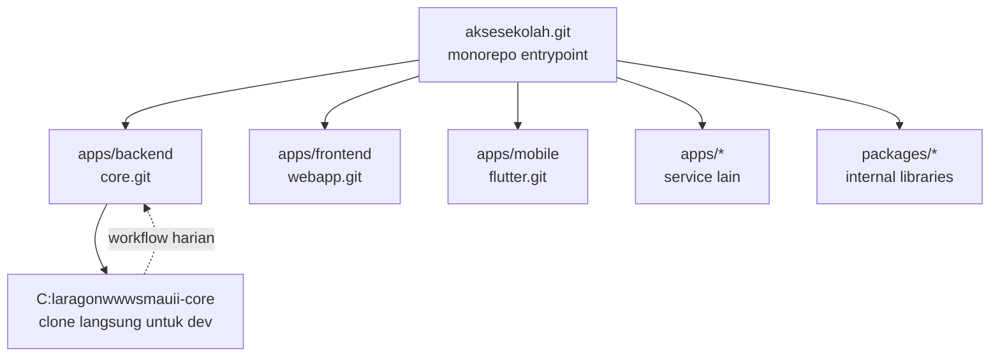

# Arsitektur Monorepo & Tata Letak Direktori

## Filosofi

Repositori `aksesekolah.git` dirancang sebagai **monorepo entrypoint** — sebuah repositori pusat yang menjadi pintu masuk tunggal bagi seluruh ekosistem aplikasi SMA UII. Monorepo ini tidak menyimpan kode aplikasi secara langsung, melainkan menggunakan **Git Submodules** untuk merujuk ke repositori aplikasi yang terpisah.

Pendekatan ini memberikan keseimbangan antara:
- **Isolasi teknis** — setiap sub-proyek memiliki siklus rilis, dependency, dan timnya sendiri
- **Visibilitas organisasi** — semua proyek terlihat dari satu titik masuk
- **Skalabilitas** — ketika ekosistem tumbuh, submodule baru dapat ditambahkan tanpa mengganggu yang lain

## Struktur Direktori

```
smauii-aksesekolah/                        ← origin: git@github.com:SMA-UII-Yogyakarta/aksesekolah.git
│
├── brief/                                 ← Dokumen perencanaan awal (tidak berubah)
│   ├── SMART Absen SMA UII.md
│   ├── LAPORAN ANALISIS KEBUTUHAN SISTEM.md
│   ├── Rencana ERD.md
│   └── ERD.png
│
├── docs/                                  ← Dokumentasi teknis untuk tim/maintainer
│   ├── README.md                          ← Indeks dokumentasi
│   ├── 01-arsitektur-monorepo.md          ← [dokumen ini]
│   ├── 02-lingkungan-development.md
│   ├── 03-requirement-analisis.md
│   ├── 04-erd-database.md
│   ├── 05-modul-alur-flow.md
│   ├── 06-keamanan-sso.md
│   ├── 07-git-workflow-submodule.md
│   ├── 08-budget-timeline-roadmap.md
│   └── 09-deployment-infrastruktur.md
│
├── apps/                                  ← Submodul aplikasi
│   ├── backend/                           ← submodule → git@github.com:SMA-UII-Yogyakarta/core.git
│   │                                          Backend Laravel (implementasi utama)
│   │
│   ├── frontend/                          ← submodule → git@github.com:SMA-UII-Yogyakarta/webapp.git
│   │                                          Frontend terpisah (React/Vue/Livewire)
│   │                                          [FUTURE - belum diaktifkan]
│   │
│   ├── mobile/                            ← submodule → git@github.com:SMA-UII-Yogyakarta/flutter.git
│   │                                          Mobile app native (Android/iOS)
│   │                                          [FUTURE - belum diaktifkan]
│   │
│   └── ...                                ← Submodul lain sesuai kebutuhan:
│                                              - API serverless (Hono/Bun, NestJS)
│                                              - Gateway/Proxy service
│                                              - Background worker service
│                                              dll.
│
├── packages/                              ← Submodul utilitas internal SMA UII
│   │                                         Library bersama yang digunakan antar aplikasi
│   │                                         (misal: package Laravel custom, helper traits, dll.)
│   └── ...                                ← [FUTURE - belum diisi]
│
├── .gitignore
├── .gitmodules
└── README.md
```

## Diagram Alur Submodule



## Alur Kerja Developer

### Untuk Backend Developer (Laravel)

1. Clone `core.git` langsung ke `C:\laragon\www\smauii-core`:
   ```bash
   git clone git@github.com:SMA-UII-Yogyakarta/core.git C:\laragon\www\smauii-core
   ```

2. Kerja seperti biasa di folder `smauii-core` — Laragon akan otomatis mengenali dan
   menyediakan akses via `http://smauii-core.test`

3. Dari monorepo `aksesekolah`, update submodule `apps/backend` agar sinkron:
   ```bash
   cd C:\laragon\www\smauii-aksesekolah
   git submodule update --remote apps/backend
   git add apps/backend
   git commit -m "chore: update backend submodule"
   git push
   ```

### Untuk Developer Lain (Frontend/Mobile)

- Cukup clone repositori masing-masing secara mandiri
- Monorepo tetap menjadi *entrypoint* untuk mengetahui semua proyek yang sedang berjalan

## Keuntungan Arsitektur Ini

1. **Entrypoint tunggal** untuk orientasi anggota tim baru
2. **Submodule isolation** — tiap repositori punya riwayat dan issue tracker sendiri
3. **Perubahan arsitektur minim** — menambah/menghapus submodule tidak mengganggu submodule lain
4. **Fleksibel** — ketika monorepo dirasa tidak lagi cocok, submodule dapat diputus tanpa kehilangan sejarah
