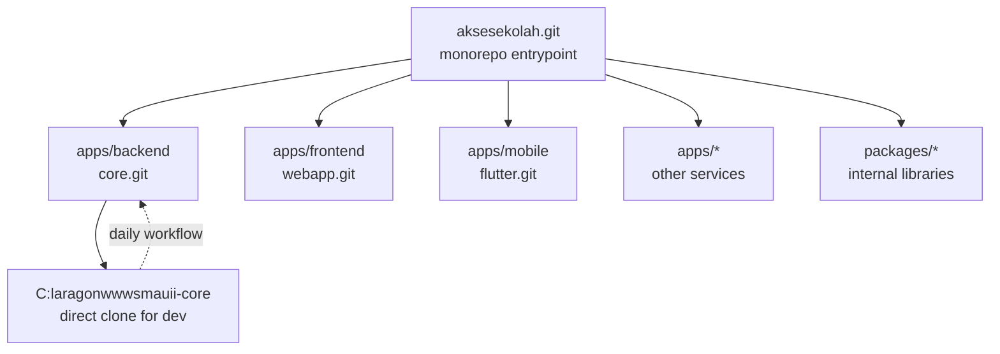

# Monorepo Architecture & Directory Layout

## Philosophy

The `aksesekolah.git` repository is designed as a **monorepo entrypoint** — a central repository that serves as the single entry point for the entire SMA UII application ecosystem. This monorepo does not store application code directly, but instead uses **Git Submodules** to reference separate application repositories.

This approach provides a balance between:
- **Technical isolation** — each sub-project has its own release cycle, dependencies, and team
- **Organizational visibility** — all projects are visible from a single entry point
- **Scalability** — as the ecosystem grows, new submodules can be added without disrupting others

## Directory Structure

```
smauii-aksesekolah/                        ← origin: git@github.com:SMA-UII-Yogyakarta/aksesekolah.git
│
├── brief/                                 ← Initial planning documents (unchanged)
│   ├── SMART Absen SMA UII.md
│   ├── LAPORAN ANALISIS KEBUTUHAN SISTEM.md
│   ├── Rencana ERD.md
│   └── ERD.png
│
├── docs/                                  ← Technical documentation for team/maintainers
│   ├── README.md                          ← Documentation index
│   ├── 01-arsitektur-monorepo.md          ← [this document]
│   ├── 02-lingkungan-development.md
│   ├── 03-requirement-analisis.md
│   ├── 04-erd-database.md
│   ├── 05-modul-alur-flow.md
│   ├── 06-keamanan-sso.md
│   ├── 07-git-workflow-submodule.md
│   ├── 08-budget-timeline-roadmap.md
│   └── 09-deployment-infrastruktur.md
│
├── apps/                                  ← Application submodules
│   ├── backend/                           ← submodule → git@github.com:SMA-UII-Yogyakarta/core.git
│   │                                          Laravel backend (main implementation)
│   │
│   ├── frontend/                          ← submodule → git@github.com:SMA-UII-Yogyakarta/webapp.git
│   │                                          Separate frontend (Next.js)
│   │                                          [FUTURE - not yet active — Phase 2]
│   │
│   ├── mobile/                            ← submodule → git@github.com:SMA-UII-Yogyakarta/flutter.git
│   │                                          Native mobile app (Android/iOS)
│   │                                          [FUTURE - not yet active]
│   │
│   └── ...                                ← Other submodules as needed:
│                                              - API serverless (Hono/Bun, NestJS)
│                                              - Gateway/Proxy service
│                                              - Background worker service
│                                              etc.
│
├── packages/                              ← Internal SMA UII utility submodules
│   │                                         Shared libraries used across applications
│   │                                         (e.g., custom Laravel packages, helper traits, etc.)
│   └── ...                                ← [FUTURE - not yet populated]
│
├── .gitignore
├── .gitmodules
└── README.md
```

## Submodule Flow Diagram



## Developer Workflow

### For Backend Developer (Laravel)

1. Clone `core.git` directly to `C:\laragon\www\smauii-core`:
   ```bash
   git clone git@github.com:SMA-UII-Yogyakarta/core.git C:\laragon\www\smauii-core
   ```

2. Work as usual in the `smauii-core` folder — Laragon will automatically recognize and
   provide access via `http://smauii-core.test`

3. From the `aksesekolah` monorepo, update the `apps/backend` submodule to keep it in sync:
   ```bash
   cd C:\laragon\www\smauii-aksesekolah
   git submodule update --remote apps/backend
   git add apps/backend
   git commit -m "chore: update backend submodule"
   git push
   ```

### For Other Developers (Frontend/Mobile)

- Simply clone each repository independently
- The monorepo remains the *entrypoint* to know about all ongoing projects

## Advantages of This Architecture

1. **Single entrypoint** for new team member orientation
2. **Submodule isolation** — each repository has its own history and issue tracker
3. **Minimal architectural changes** — adding/removing submodules does not affect others
4. **Flexible** — when monorepo is no longer suitable, submodules can be detached without losing history
